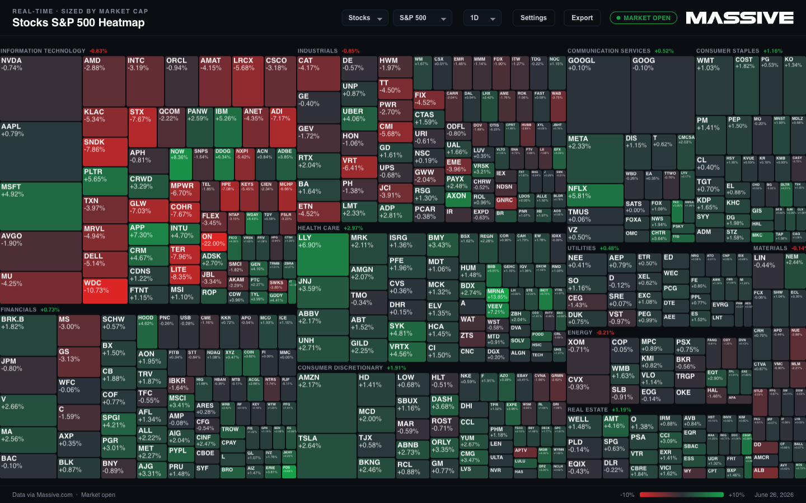
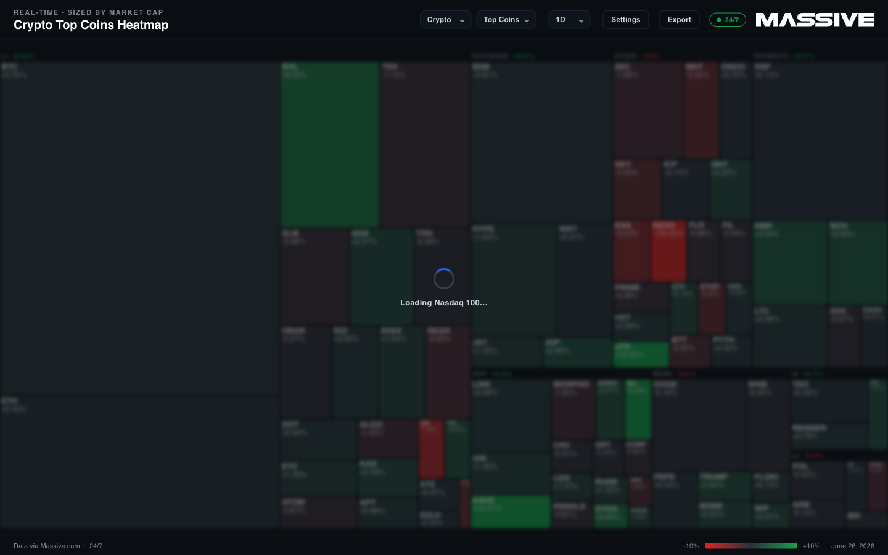
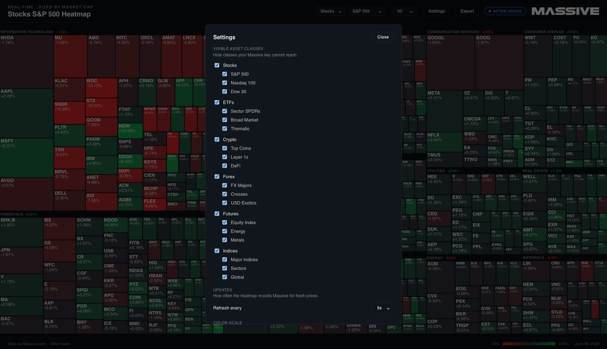
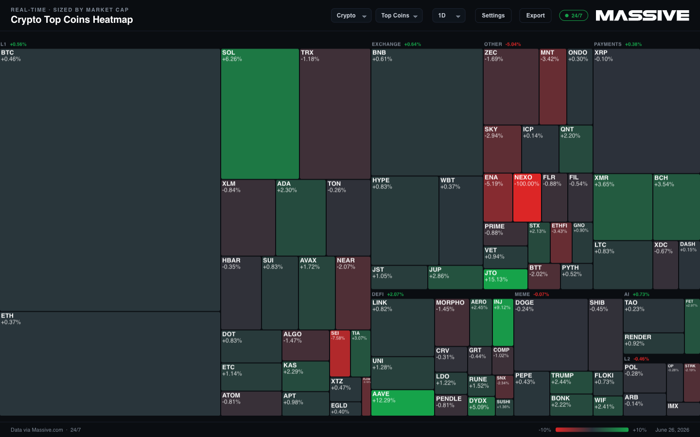
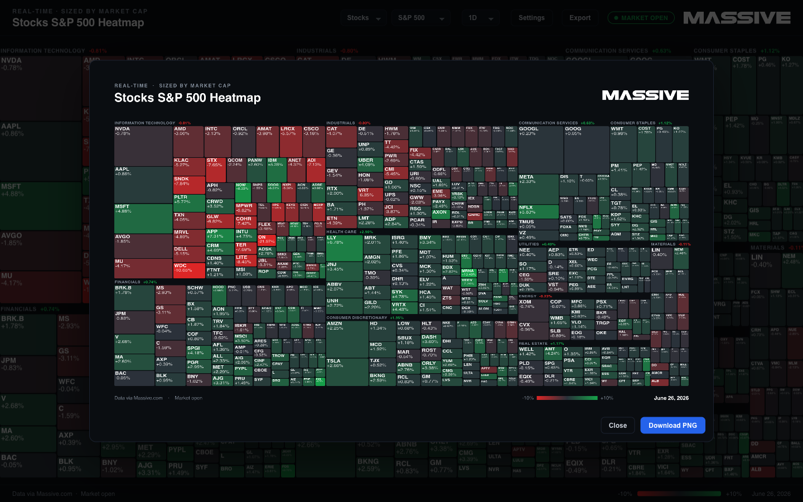

# Massive Heatmap

A live, cross-asset market heatmap built on Massive's REST API. Pick an asset class and a universe, and the screen fills with tiles sized by market cap and colored by percent change. Prices recolor in place as each REST snapshot refresh lands. Switch the lookback to see change over a day, a quarter, or five years, and export a branded PNG of whatever is on screen.



## What it does

- **Cross-asset coverage.** Stocks (S&P 500, Nasdaq 100, Dow 30), ETFs, crypto, forex, indices, and futures, across 18 prebuilt universes.
- **Live recoloring.** A diverging red-to-green color scale that updates every few seconds as the backend re-polls the snapshot. The refresh interval is configurable in Settings (2s to 60s). Equities move during US market hours including pre-market and after-hours; crypto and forex move around the clock.
- **Market cap sizing.** Tile area is proportional to market cap, so the names that move the index get the most screen.
- **Sector and category grouping.** GICS sectors for equities, thematic categories (Layer 1s, DeFi, Exchange, Energy, Metals, and so on) for everything else.
- **Selectable lookback.** Compare against the prior close (1D) or against the close 7, 30, 90, or 180 days ago, 1 year, or 5 years back. The color scale rescales with the window so a 5-year move and a one-day move both read clearly.
- **Session awareness.** A badge shows pre-market, regular session, after-hours, or closed for equities, and 24/7 for crypto and forex.
- **Zoom and pan.** Scroll to zoom toward the cursor, drag to pan, double-click to reset. Useful on the 500-tile S&P view.
- **Hover details.** Hovering a tile shows the ticker, name, current price, the period reference price, and the percent change.
- **PNG export.** One click renders a branded 16:9 snapshot of the current view and downloads it.

## How it works

The project is a Node + TypeScript backend paired with a React + TypeScript (Vite) frontend. The frontend never talks to Massive directly. It calls the backend over plain HTTP, and the backend holds your API key, brokers all Massive traffic.

```
browser ──GET /api/snapshot──> Node backend ──REST seed───────> api.massive.com
browser ──GET /api/prices ───> Node backend ──REST snapshot───> api.massive.com
        (every refresh interval)
```

**Seed, then poll.** When you select a universe, the backend first fetches a REST snapshot to establish a reference price for every ticker. The seed matters: it gives the frontend a baseline to color against from the moment the page loads, so tiles are correct before any update arrives. Then the browser polls for current prices on the interval you set.

- For **1D**, the reference is the prior official close, read straight from the snapshot.
- For **longer lookbacks**, the backend fetches the historical close at the start of the window (grouped daily aggregates for stocks, ETFs, crypto, and forex in a single call; per-ticker daily aggregates for indices; session aggregates for futures) and colors today's price against that.

**Live updates.** After the seed, the browser polls `/api/prices` on the interval you choose in Settings. Each poll asks the backend for the current price of every ticker in the universe; the backend fetches a fresh REST snapshot (cached for a second so multiple tabs share one outbound call) and returns the new price and percent change per tile. The canvas recolors in place as each refresh lands.

**Loading state.** Switching universe, asset class, or lookback triggers a fresh seed on the backend. While that is in flight the heatmap dims and a spinner names what is loading, then clears the moment the new snapshot lands. (Changing the refresh interval does not re-seed; it just re-times the poll in place.)



### Project layout

- `backend/`: the Node REST proxy. Built on the official `@massive.com/client-js` client. Handles seeding (`seed.ts`), current-price snapshots (`prices.ts`), session phase (`session.ts`), and the HTTP API (`server.ts`).
- `frontend/`: the Vite app. Renders the canvas treemap, recalculates the color scale on each update, and owns tooltips, the session badge, settings, and the export flow.
- `universes/`: JSON files defining ticker membership, sector or category groupings, and market cap weights for each universe.
- `shared/`: the wire protocol and universe types shared by both ends.

## Massive subscriptions you need

On Massive each asset class is its own subscription. This app needs **REST snapshot access** (the snapshot endpoints that return the latest price per ticker) and, ideally, **real-time data** so the colors reflect now rather than a delayed tape. The free Basic tier of every class is end-of-day only, so it will not drive the heatmap.

The prices below are individual (non-professional) monthly plans. Annual billing saves 20%. Business and enterprise use is covered separately, see [Business use](#business-use).

| App asset class | Massive product | Real-time | Lowest tier with snapshot (delayed) |
|---|---|---|---|
| Stocks and ETFs | Stocks | Stocks Advanced, $199/mo | Stocks Starter, $29/mo (15-min delayed) |
| Crypto and Forex | Currencies | Currencies Starter, $49/mo (real-time included) | same plan |
| Indices | Indices | Indices Advanced, $99/mo | Indices Starter, $49/mo (15-min delayed) |
| Futures | Futures | Futures Advanced, $199/mo | Futures Starter, $29/mo (10-min delayed) |

A few things worth knowing:

- **Currencies is a single subscription that covers both crypto and forex**, and its entry Starter tier is already real-time, so it is the best value for the most live motion.
- **For stocks, futures, and indices, real-time lives only in the top tier.** The cheaper Starter and Developer tiers still include the snapshot endpoint, so the heatmap works and recolors, just on a 10 to 15 minute delay. That is a fine way to demo the app without paying for real-time. (Set a longer refresh interval on a delayed tier; there is no point polling every 2s for data that updates every 15 minutes.)
- **ETFs ride on the Stocks subscription**, since they are equities. There is no separate ETF plan.
- **Real-time individual plans are non-professional use only.** Commercial use needs a Business plan.

**You do not need all four.** The default S&P 500 view needs only a Stocks plan. Open Settings and uncheck any asset class your key cannot reach, and the app runs on the subset you have.

### Business use

Individual real-time plans are restricted to non-professional use. For commercial or company use, Massive offers Business plans (for example, Stocks Business at $1,999/mo with real-time data and full history) and a custom Enterprise tier with dedicated support and tailored exchange feeds. Startups can ask about up to 50% off the first year.

See [massive.com/pricing](https://massive.com/pricing) for individual plans and [massive.com/business](https://massive.com/business) for business and enterprise pricing. Prices here were current at the time of writing; check the site for the latest.



## Getting started

**Requirements:** Node.js 18 or newer, and a Massive API key on a paid tier with snapshot access for at least one asset class (see [Massive subscriptions](#massive-subscriptions-you-need)). A real-time tier gives live colors; a delayed tier works too, just on a delay.

```bash
cp .env.example .env
# open .env and set MASSIVE_API_KEY
```

```bash
npm install
npm run dev
```

`npm run dev` starts the backend (on `http://localhost:8787`) and the Vite dev server together. Vite proxies `/api` to the backend, so open the URL Vite prints, usually `http://localhost:5173`, and the heatmap loads against the S&P 500.

## Configuration

Open **Settings** in the top bar to:

- **Set the refresh interval.** How often the heatmap polls for fresh prices, from 2s to 60s (default 5s). Lower is more live; higher is lighter on the API, which is the right call on a delayed tier.
- **Hide asset classes and universes** your key cannot reach, so the dropdowns only show what you can actually load. Hidden segments fall back to the first visible one.
- **Tune the color scale per lookback.** Each lookback has a clamp, the percent move that fully saturates red or green. Defaults scale with the window (±6% for 1D up to ±300% for 5Y); override any of them to suit your universe.

Settings persist in the browser's local storage. There is nothing to configure on the backend beyond the API key.

## Universes

Eighteen universes ship across six asset classes, grouped in the two dropdowns by class and then by universe.

| Asset class | Universes |
|---|---|
| Stocks | S&P 500, Nasdaq 100, Dow 30 |
| ETFs | Sector SPDRs, Broad Market, Thematic |
| Crypto | Top Coins, Layer 1s, DeFi |
| Forex | FX Majors, Crosses, USD Exotics |
| Futures | Equity Index, Energy, Metals |
| Indices | Major Indices, Sectors, Global |



Constituent lists and groupings are a shipped snapshot in `universes/`. Market cap weights come from Massive reference data and may need a periodic refresh as index composition changes. To add a universe, drop a new JSON file in `universes/` following the `Constituent` and `Universe` shape in `shared/universe.ts`, then add it to the dropdown lists in `frontend/src/Controls.tsx`.

## Export

The **Export** button opens a preview of a branded 16:9 composition (the heatmap, a header with the universe title and the MASSIVE wordmark, and a footer with the session, date, and legend), then downloads it as a PNG. It renders at 2x for a crisp image, and lays the treemap out at the export's own dimensions so tiles keep their true proportions.



## Running locally

This example runs locally with one command. There is nothing to deploy: `npm run dev` starts the backend and the Vite dev server together, and Vite proxies `/api` to the backend. See [Getting started](#getting-started) for the full steps. The backend holds your `MASSIVE_API_KEY` and brokers every Massive call, so the key never reaches the browser.

## Notes

- **Lookback applies to non-futures classes.** Futures roll across contracts, so a fixed lookback is not meaningful. The futures view is forced to intraday (open to close on the front-month contract) and the lookback selector is hidden while a futures universe is shown.
- **Long windows can leave a few tiles neutral.** For 1Y and 5Y lookbacks, a ticker that did not trade at the window start (a recent listing, or a futures contract that did not exist yet) has no historical close to compare against. Those tiles stay neutral rather than show a faked move.
- **Off-hours stillness is expected.** Equity prices only move during US market hours. Crypto and forex move 24/7, so those universes show live motion at any time of day.

## Disclaimer

**Warning:** The examples, demos, and outputs produced with this project are generated by artificial intelligence and large language models. You acknowledge that this project and any outputs are provided "AS IS", may not always be accurate and may contain material inaccuracies even if they appear accurate because of their level of detail or specificity, outputs may not be error free, accurate, current, complete, or operate as you intended, you should not rely on any outputs or actions without independently confirming their accuracy, and any outputs should not be treated as financial or legal advice. You remain responsible for verifying the accuracy, suitability, and legality of any output before relying on it.

## License

This project is licensed under the [MIT License](../../../LICENSE).
