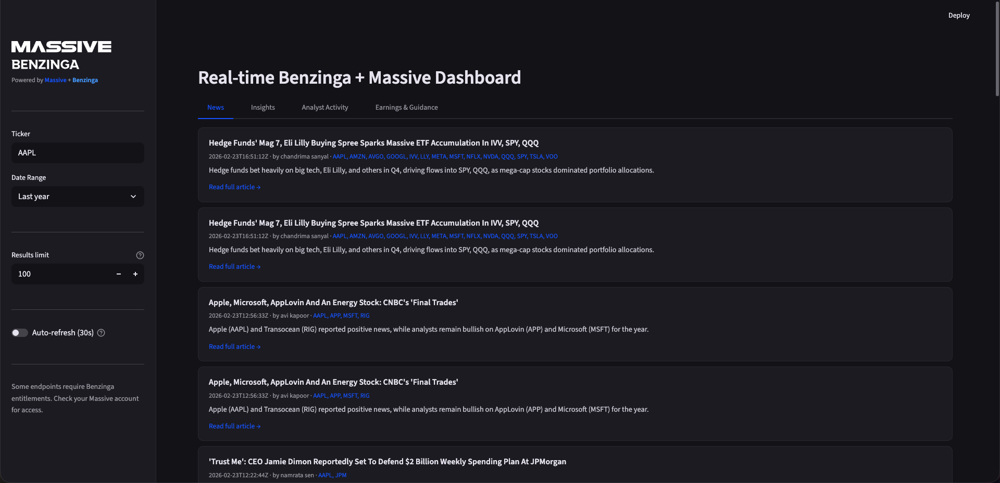
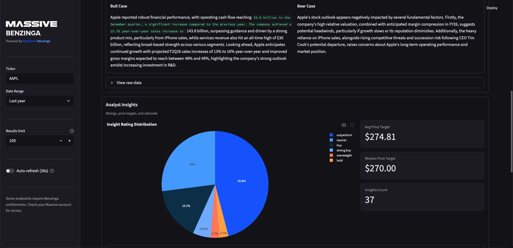
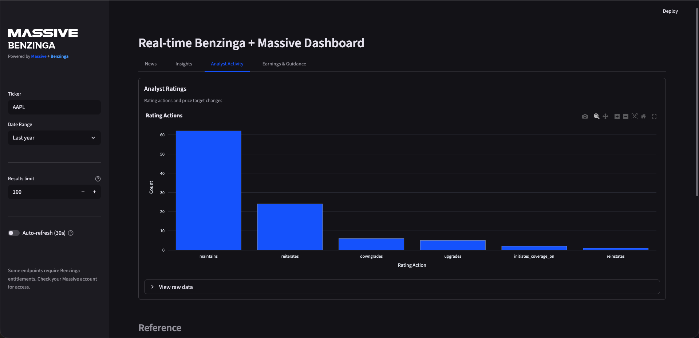
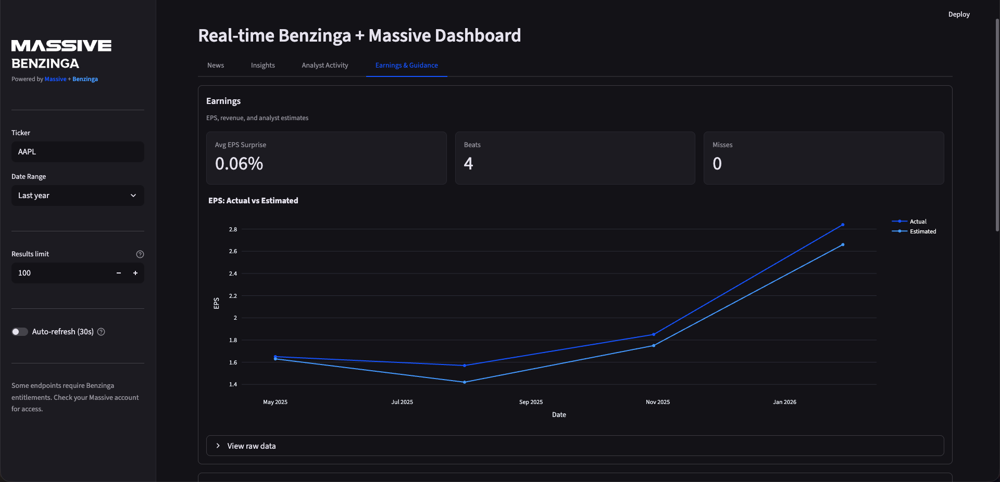

# Real-time Benzinga + Massive Dashboard

<div align="center">
  
</div>

A Streamlit dashboard that demonstrates how Massive's Benzinga partnership endpoints can power a real-time financial news and analytics monitor. This single-file app layers interactive visualizations, filtering, and polled auto-refresh on top of 9 Benzinga endpoints.

## Highlights

- **Real-time News Feed** -- Structured news articles rendered as styled cards with headlines, teasers, author attribution, ticker tags, and links to full text. Supports multi-ticker filtering.
- **Analyst Insights** -- Consensus rating breakdowns, bull/bear case summaries, and individual analyst price targets with rating distribution charts.
- **Earnings & Guidance** -- EPS actual vs estimated (line or grouped bar), surprise metrics, and corporate guidance with projected EPS/revenue figures.
- **Analyst Activity** -- Rating action tracking (upgrades, downgrades, initiations) with bar chart visualizations.
- **Reference Directories** -- Analyst and firm directories with top-firms-by-analyst-count charts, always visible below the main tabs.
- **Polled Auto-refresh** -- 60-second cache TTL on all endpoints with optional 30-second polling via `streamlit-autorefresh`.
- **Interactive Plotly Charts** -- All visualizations use a custom dark theme with the Massive blue + Benzinga navy color palette.
- **Flexible Sidebar Filters** -- Filter by ticker, date range (last 7/30/90 days, last year, custom, or all), and per-endpoint result limit up to 500.









## Disclaimer

**Warning:** The examples, demos, and outputs produced with this project are generated by artificial intelligence and large language models. You acknowledge that this project and any outputs are provided "AS IS", may not always be accurate and may contain material inaccuracies even if they appear accurate because of their level of detail or specificity, outputs may not be error free, accurate, current, complete, or operate as you intended, you should not rely on any outputs or actions without independently confirming their accuracy, and any outputs should not be treated as financial or legal advice. You remain responsible for verifying the accuracy, suitability, and legality of any output before relying on it.

## Quickstart (with [uv](https://github.com/astral-sh/uv))

### Prerequisites

- Python 3.11+
- [uv](https://github.com/astral-sh/uv) installed
  ```bash
  curl -Ls https://astral.sh/uv/install.sh | sh
  ```
- Massive API key with Benzinga partnership entitlement

### Installation

1. **Clone and enter this example:**
   ```bash
   git clone https://github.com/massive-com/community.git
   cd community/examples/rest/partner-benzinga
   ```

2. **Install dependencies with uv:**
   ```bash
   uv sync
   ```

3. **Configure environment variables:**
   ```bash
   cp .env.example .env
   # Edit .env and add your Massive API key
   ```

4. **Verify entitlements:**
   - Sign in at [massive.com](https://massive.com/dashboard)
   - Make sure the Benzinga partnership is enabled on your account
   - Copy the API key into `.env`

### Run the dashboard

```bash
uv run streamlit run streamlit_app.py
```

- The app auto-loads `.env` and also respects `st.secrets["MASSIVE_API_KEY"]` for hosted runs.
- **Filter Data**: Use the sidebar to enter a ticker, select a date range, and set a result limit. The News tab supports comma-separated tickers (e.g. `AAPL, MSFT`); all other tabs use a single ticker.
- **Explore Tabs**: Navigate the four main tabs -- News, Insights, Analyst Activity, and Earnings & Guidance -- then scroll to the Reference section for analyst/firm directories.
- **Real-time Data**: Enable the auto-refresh toggle for 30-second polling. All endpoints use a 60-second cache TTL.
- **View Details**: Expand "View raw data" sections in each card for the full sortable DataFrame.

## How the Demo Works

### 1. Data Fetching

- All endpoints use the official Massive Python client (`massive>=2.0.2`) via typed methods like `list_benzinga_news_v2`, `list_benzinga_ratings`, etc.
- Each fetch function is wrapped with `@st.cache_data(ttl=60)` for a 60-second real-time cache with loading spinners.
- Non-news endpoints accept a single `ticker` string passed directly to the API. The news endpoint supports multi-ticker queries via `tickers_any_of`.
- Error handling catches `BadResponse` and general exceptions, logging them and returning an empty DataFrame so the UI degrades gracefully.

### 2. Tab Layout

| Tab | Endpoints Used | Key Visuals |
| --- | --- | --- |
| **News** | News | HTML news cards, top channels bar chart |
| **Insights** | Consensus Ratings, Bulls & Bears Say, Analyst Insights | Consensus pie chart, bull/bear expanders, insight rating pie + price target metrics |
| **Analyst Activity** | Analyst Ratings | Rating action bar chart |
| **Earnings & Guidance** | Earnings, Corporate Guidance | EPS actual vs estimated (line or grouped bar), EPS surprise metrics, guidance EPS/revenue metrics |
| **Reference** _(below tabs)_ | Analyst Details, Firm Details | Top firms bar chart, analyst/firm directory tables |

### 3. Visualizations

All charts use a custom Plotly dark template (`massive_dark`) with the Massive blue + Benzinga navy color palette:

- **Consensus Ratings** -- Pie chart of rating breakdown (Strong Buy through Strong Sell)
- **Analyst Insights** -- Pie chart of insight rating distribution + average/median price target metrics
- **Analyst Ratings** -- Bar chart of rating actions (upgrades, downgrades, initiations, etc.)
- **Earnings** -- EPS actual vs estimated rendered as a line chart (4+ data points) or grouped bar chart (3 or fewer), plus EPS surprise summary metrics
- **News** -- HTML article cards with metadata and a top-10 news channels bar chart
- **Reference** -- Top firms by analyst count bar chart

### 4. Filtering

- **Ticker**: Single ticker for Insights, Analyst Activity, and Earnings & Guidance tabs. Comma-separated tickers for the News tab.
- **Date Range**: Presets (Last 7/30/90 days, Last year, All) or custom start/end date pickers. End dates include today's data automatically.
- **Result Limit**: Adjustable 1-500 per endpoint (default 100).

### 5. Real-time Capabilities

- **Cache TTL**: All `@st.cache_data` decorators use `ttl=60` seconds so data refreshes on every Streamlit rerun after the cache expires.
- **Auto-refresh**: Optional 30-second polling via `streamlit-autorefresh` triggers a full page rerun. The 60-second TTL naturally expires, so data is at most 60 seconds stale.

## Configuration

| Variable | Description |
| --- | --- |
| `MASSIVE_API_KEY` | Required. API key with Benzinga partnership access. |
| `LOG_LEVEL` | Optional. Defaults to `INFO`. Set to `DEBUG` for verbose logging. |

- The dashboard loads `.env` at startup and falls back to Streamlit secrets when deployed.
- All outbound requests go through the official `massive>=2.0.2` Python client.
- **Data Sorting**: All endpoints are sorted by relevant date fields (descending) to show the most recent data first.
- **Smart Caching**: 60-second cache TTL on every endpoint minimizes redundant API calls while keeping data fresh.
- **Error Handling**: Missing entitlements or API errors produce in-app messages rather than crashes.

## Troubleshooting

| Issue | Fix |
| --- | --- |
| `MASSIVE_API_KEY is missing` | Copy `.env.example` to `.env` and add your key, or supply `st.secrets`. |
| `RuntimeError: Unable to load ...` | Usually an entitlement or rate-limit problem -- check your plan and retry. |
| `NOT_AUTHORIZED` warnings | Your API key doesn't have Benzinga partnership entitlements. Visit [massive.com/partners/benzinga](https://massive.com/partners/benzinga) to upgrade. |
| Empty charts/tables | The selected filters may not return data. Try widening the date range, removing the ticker filter, or checking a different tab. |
| Auto-refresh not updating | Make sure the auto-refresh toggle is enabled in the sidebar. Polling occurs every 30 seconds; all other data refreshes on the 60-second cache TTL. |
| Multiple tickers show no data on non-News tabs | Only the News tab supports multi-ticker input. Enter a single ticker for Insights, Analyst Activity, and Earnings & Guidance. |
| TLS errors inside corporate networks | Configure your system trust store or set the `REQUESTS_CA_BUNDLE` env var. |

## Supported Endpoints

The dashboard showcases all 9 currently available Benzinga endpoints through Massive:

| # | Endpoint | Route | Key Filters |
| --- | --- | --- | --- |
| 1 | **News** | `/benzinga/v2/news` | tickers, date range, channels, tags, author |
| 2 | **Analyst Ratings** | `/benzinga/v1/ratings` | ticker, date range, firm, rating action |
| 3 | **Analyst Insights** | `/benzinga/v1/analyst-insights` | ticker, date range |
| 4 | **Analyst Details** | `/benzinga/v1/analyst-details` | limit |
| 5 | **Earnings** | `/benzinga/v1/earnings` | ticker, date range, fiscal period |
| 6 | **Consensus Ratings** | `/benzinga/v1/consensus-ratings` | ticker |
| 7 | **Bulls & Bears Say** | `/benzinga/v1/bulls-bears-say` | ticker |
| 8 | **Corporate Guidance** | `/benzinga/v1/corporate-guidance` | ticker, date range |
| 9 | **Firm Details** | `/benzinga/v1/firm-details` | limit |

## API Reference

This demo uses the following Massive API endpoints:

- **Base URL**: `https://api.massive.com`
- **Documentation**: [massive.com/docs/rest/partners/benzinga](https://massive.com/docs/rest/partners/benzinga)

Common query parameters across endpoints:
- `ticker` -- Stock ticker symbol (where applicable)
- `tickers` / `tickers.any_of` -- Multi-ticker filtering (news endpoint)
- `date.gte` / `date.lte` -- Date range filtering (where applicable)
- `limit` -- Maximum number of results (default: 100, max: 50000)
- `sort` -- Sort order (e.g., `date.desc`, `published.desc`)

## License

This project is licensed under the [MIT License](../../../LICENSE).
