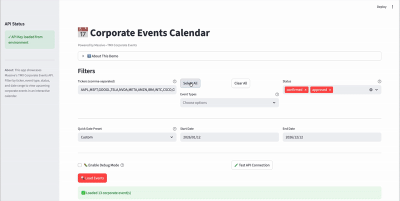

# Corporate Events Calendar Powered by TMX Wall Street Horizon + Massive

<div align="center">
  
</div>

A Streamlit dashboard that demonstrates how Massive's TMX Wall Street Horizon Corporate Events API can be used to visualize and track corporate events. This demo showcases earnings announcements, dividends, shareholder meetings, conferences, and more in an interactive calendar interface with flexible filtering and detailed event information.

## ✨ Highlights

- **Interactive Calendar View** – Visualize corporate events in a FullCalendar-style interface with month view. Events are color-coded by type (earnings=red, dividends=green, conferences=blue, etc.) for quick scanning. Click any event to view detailed information.
- **Comprehensive Event Filtering** – Filter by ticker(s), event type, status (confirmed, approved, canceled, etc.), and date range. Supports 22 different event types including earnings, dividends, shareholder meetings, conferences, and more. Quick "Select All" and "Clear All" buttons for event types.
- **Quick Date Presets** – Fast access to common date ranges including quarters, next 30/60/90 days, current/next quarter, or custom date ranges up to 365 days. Historical data available back to January 1, 2018.
- **Event Details Panel** – Click any event in the calendar to view comprehensive details including company name, ticker, ISIN, trading venue, status, and links to source announcements.
- **Table View** – Alternative tabular view with sortable, filterable data for bulk event analysis and easy CSV export.
- **Performance Optimized** – Single API call using `any_of` filter modifiers, single-pass statistics calculation, and cached operations for fast loading.

<div align="center">
  
</div>

## Disclaimer

**Warning:** The examples, demos, and outputs produced with this project are generated by artificial intelligence and large language models. You acknowledge that this project and any outputs are provided "AS IS", may not always be accurate and may contain material inaccuracies even if they appear accurate because of their level of detail or specificity, outputs may not be error free, accurate, current, complete, or operate as you intended, you should not rely on any outputs or actions without independently confirming their accuracy, and any outputs should not be treated as financial or legal advice. You remain responsible for verifying the accuracy, suitability, and legality of any output before relying on it.

## Quickstart (with [uv](https://github.com/astral-sh/uv))

### Prerequisites

- Python 3.10+
- [uv](https://github.com/astral-sh/uv) installed
  ```bash
  curl -Ls https://astral.sh/uv/install.sh | sh
  ```
- Massive API key with TMX Wall Street Horizon Corporate Events entitlement

### Installation

1. **Clone and enter this example:**
   ```bash
   git clone https://github.com/massive-com/community.git
   cd community/examples/rest/partner-tmx
   ```

2. **Install dependencies with uv:**
   ```bash
   uv sync
   ```

3. **Configure environment variables:**
   ```bash
   cp env.example .env
   # Edit .env and add your Massive API key
   ```

4. **Verify entitlements:**
   - Sign in at [massive.com](https://massive.com/dashboard)
   - Make sure the TMX Wall Street Horizon Corporate Events partnership is enabled on your account
   - Copy the API key into `.env`

### Run the dashboard

```bash
uv run streamlit run streamlit_app.py
```

- The app auto-loads `.env` and also respects `st.secrets["MASSIVE_API_KEY"]` for hosted runs.
- **Filter Events**: Enter ticker(s) (comma-separated), select event types and statuses, choose a date range preset or set custom dates, then click "Load Events".
- **View Events**: Browse events in the interactive calendar or switch to the table view for detailed data.
- **Event Details**: Click any event in the calendar to view full details including company information, event type, status, and source URLs.
- **Performance Note**: The app makes a single optimized API call using `any_of` filter modifiers for multiple tickers, event types, and statuses, resulting in fast loading times.

## 🧠 How the Demo Works

### 1. Event Filtering & API Calls

- Uses the official Massive Python client with the low-level `_get()` method to access advanced filter modifiers.
- Supports filtering by:
  - **Tickers**: Single ticker or multiple tickers using `ticker.any_of` filter modifier (e.g., `AAPL,MSFT,GOOGL`)
  - **Event Types**: 22 different event types including earnings announcements, dividends, shareholder meetings, conferences, analyst days, and more. Uses `type.any_of` for multiple types. Quick "Select All" and "Clear All" buttons for easy selection.
  - **Status**: Filter by confirmed, approved, canceled, postponed, pending approval, historical, or unconfirmed events. Uses `status.any_of` for multiple statuses.
  - **Date Range**: Flexible date filtering with quick presets or custom ranges (up to 365 days)
- **API Call Strategy**: The app makes optimized API calls using `any_of` filter modifiers (`ticker.any_of`, `type.any_of`, `status.any_of`) when multiple values are provided. Single values use standard parameters (`ticker`, `type`, `status`). The app automatically handles pagination by following `next_url` links until all results are retrieved, ensuring you see all available events for your filters.

### 2. Interactive Calendar View

- Built with `streamlit-calendar` component (FullCalendar.js wrapper).
- **Color Coding**:
  - 🔴 Red: Earnings-related events (announcements, conference calls, results)
  - 🟢 Green: Dividends
  - 🔵 Blue: Conferences, forums, summits
  - 🟣 Purple: Shareholder meetings
  - 🟠 Orange: Business updates, production updates, service updates
  - 🟡 Yellow: Other event types
- **Month View**: Calendar displays events in a month view for easy browsing.
- **Event Details**: Click any event in the calendar to see comprehensive information in a formatted panel with source links. Event details appear below the calendar with a close button to dismiss them.

### 3. Table View

- Displays events in a sortable, filterable pandas DataFrame.
- Shows key columns: date, ticker, company name, event type, status, and event name.
- Supports easy CSV export via Streamlit's built-in DataFrame export.
- Optional JSON view for full event payload inspection.

### 4. Statistics & Metrics

- **Total Events**: Count of all retrieved events
- **Unique Tickers**: Number of distinct tickers in the result set
- **Earnings Events**: Count of earnings-related events (any event type containing "earnings")
- **Confirmed Events**: Count of events with confirmed or approved status
- All statistics are calculated in a single pass for performance.

### 5. Date Range Management

- **Quick Presets**: 
  - Current and next year quarters (Q1-Q4)
  - Next 30, 60, or 90 days
  - Current Quarter and Next Quarter (auto-calculated)
  - Custom date range
- **Date Range**: Historical data available from January 1, 2018 onwards. Date ranges can extend back to January 1, 2018 (the maximum range depends on the end date selected - up to the number of days from January 1, 2018 to the end date).
- **Validation**: Automatically validates date ranges and warns if the range extends before January 1, 2018, or if start date is after end date.

## ⚙️ Configuration

| Variable | Description |
| --- | --- |
| `MASSIVE_API_KEY` | Required. API key with TMX Wall Street Horizon Corporate Events access. |

- The dashboard loads `.env` at startup and falls back to Streamlit secrets when deployed.
- All outbound requests go through the official Massive Python client.
- **Data Sorting**: Events are sorted by date ascending, then by ticker ascending.
- **Smart Caching**: Calendar events and statistics are cached using Streamlit's `@st.cache_data` decorator to minimize redundant processing.
- **Session State**: Events are stored in session state after loading, so they persist across widget interactions until new data is loaded.
- **Error Handling**: The dashboard gracefully handles API errors, missing entitlements, and displays helpful error messages with debugging tips.

## 🧪 Testing & Performance

- **Test API Connection**: Use the "Test API Connection" button to verify your API key and connectivity before loading events.
- **Debug Mode**: Enable debug mode to see detailed API request/response information including:
  - Exact parameters sent for each API call
  - Pagination progress (page number, events per page, total events)
  - Response status and result counts
  - Sample event data
- **Performance Optimizations**:
  - Single API call using `any_of` filter modifiers for efficient querying
  - Automatic pagination to fetch all available results
  - Single-pass statistics calculation
  - Cached calendar event creation
  - Cached statistics computation
- **Data Limits & Pagination**: Default limit is 50 events per API page. The app automatically follows `next_url` links to fetch all available results across multiple pages. All events are accumulated and displayed. To reduce the number of API calls, narrow your filters (reduce date range, number of tickers, or event types) or modify the `DEFAULT_LIMIT` constant in the code (max: 50000 per page).
- **Historical Data**: Date range extends back to January 1, 2018, allowing you to view historical corporate events.

## 🛠️ Troubleshooting

| Issue | Fix |
| --- | --- |
| `MASSIVE_API_KEY is missing` | Copy `env.example` to `.env` and add your key, or supply `st.secrets`. |
| `API Error` or `Request Failed` | Check your API key has TMX Corporate Events entitlements. Verify at [massive.com/dashboard](https://massive.com/dashboard). |
| `NOT_AUTHORIZED` errors | Your API key doesn't have TMX Corporate Events entitlements. Visit [massive.com/partners/tmx](https://massive.com/partners/tmx) to upgrade. |
| No events found | Try widening the date range, removing ticker filters, selecting different event types, or checking different status filters. The API may not have data for the selected combination. |
| Test API Connection hangs | Ensure your API key is valid and has proper network connectivity. Check debug mode for detailed error messages. |
| Many API calls / slow loading | The app automatically fetches all pages of results. Default limit is 50 events per page. If loading is slow, narrow your filters (reduce date range, tickers, or event types) to reduce the total number of events, or modify `DEFAULT_LIMIT` in the code (max: 50000 per page). |
| Calendar not displaying events | Verify that events were successfully loaded (check the success message). Events are only displayed if `events_loaded` is True in session state. Try clicking "Load Events" again. |
| Date range validation error | Ensure start date is before or equal to end date, and start date is not before January 1, 2018. Date ranges can extend back to January 1, 2018 (the maximum range depends on your end date). Use the date presets for common ranges. |

## 📊 Supported Event Types

The dashboard supports all 22 event types available in the TMX Corporate Events API:

- `earnings_announcement_date` - Earnings announcement dates
- `earnings_conference_call` - Earnings conference calls
- `earnings_results_announcement` - Earnings results announcements
- `dividend` - Dividend events
- `shareholder_meeting` - Shareholder meetings
- `conference` - Industry conferences
- `analyst_day` - Analyst day events
- `business_update` - Business updates
- `capital_markets_day` - Capital markets day
- `forum` - Forums
- `summit` - Summits
- `seminar` - Seminars
- `workshop` - Workshops
- `tradeshow` - Trade shows
- `interim_statement` - Interim statements
- `other_interim_announcement` - Other interim announcements
- `production_update` - Production updates
- `sales_update` - Sales updates
- `service_level_update` - Service level updates
- `research_and_development_day` - R&D day events
- `company_travel` - Company travel events
- `stock_split` - Stock split events

## 🔗 API Reference

This demo uses the following Massive API endpoint:

- **Endpoint**: `/tmx/v1/corporate-events`
- **Method**: GET
- **Documentation**: [massive.com/docs/rest/partners/tmx/corporate-events](https://massive.com/docs/rest/partners/tmx/corporate-events)

Key query parameters:
- `ticker` - Stock ticker symbol (single value)
- `ticker.any_of` - Multiple ticker symbols (comma-separated, e.g., `AAPL,MSFT,GOOGL`)
- `type` - Event type (single value)
- `type.any_of` - Multiple event types (comma-separated, e.g., `earnings_announcement_date,earnings_conference_call,dividend`)
- `status` - Event status (single value)
- `status.any_of` - Multiple statuses (comma-separated, e.g., `confirmed,approved`)
- `date.gte` - Start date (YYYY-MM-DD)
- `date.lte` - End date (YYYY-MM-DD)
- `limit` - Maximum number of results (default: 100, max: 50000)
- `sort` - Sort order (e.g., `date.asc`)

## 📄 License

This project is licensed under the [MIT License](../../../LICENSE).
