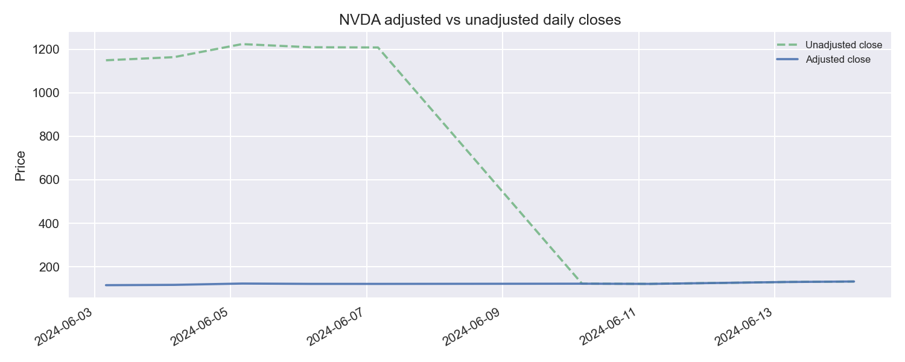
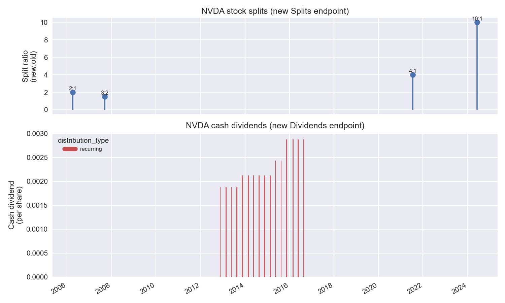

## Massive Splits & Dividends Endpoints Visualizer

<div align="center">
  
</div>

An example Python demo that showcases Massive's updated stock **Splits** and **Dividends** REST endpoints:

- **Splits:** [`/stocks/v1/splits`](https://massive.com/docs/rest/stocks/corporate-actions/splits)
- **Dividends:** [`/stocks/v1/dividends`](https://massive.com/docs/rest/stocks/corporate-actions/dividends)

These replace the deprecated reference endpoints:

- `/v3/reference/splits`
- `/v3/reference/dividends`

This demo fetches recent corporate actions for a ticker and builds simple, eye‑catching charts that show how Massive’s new corporate actions endpoints interact with price data. It is meant as a starting point for developers building:

- **Total-return charts**
- **Corporate-actions aware backtests**
- **Investor-facing dashboards**
- **Data quality checks around splits/dividends**

## 📸 Example Output





The demo also can exports a flat-file style CSV if using Massive flat file capabilities — see [`example/example-unadjusted.csv`](example/example-unadjusted.csv) for a sample.

## 📋 Requirements

- **Python** 3.11+
- **uv** package manager (`uv` is used throughout the examples)
- **python-dotenv** (automatically installed via `pyproject.toml` and used to load `.env`)

```bash
curl -Ls https://astral.sh/uv/install.sh | sh
```

- A **Massive API key**

## ⚙️ Setup

From the repo root:

```bash
cd examples/rest/splits-dividends-demo
uv sync
```

Configure your Massive API key:

```bash
cp .env.example .env
# then edit .env and set your key
```

The script uses `python-dotenv` to automatically load this `.env` file, so you don’t need to export the variable manually in your shell.

You can generate an API key from your account on [`massive.com`](https://massive.com/).

**Optional — Flat Files (S3):** To download **Stocks Day Aggregates** from [Massive Flat Files](https://massive.com/docs/flat-files/quickstart) (e.g. for the `historical_adjustment_factor` flat-file demo), add your **S3** credentials to `.env`. These are different from the REST API key and come from [Dashboard → Keys](https://massive.com/dashboard/keys):

- `MASSIVE_FLATFILES_ACCESS_KEY_ID`
- `MASSIVE_FLATFILES_SECRET_ACCESS_KEY`

See `.env.example` for the full list. Endpoint and bucket are fixed (`https://files.massive.com`, bucket `flatfiles`) per the [Flat Files Quickstart](https://massive.com/docs/flat-files/quickstart).

## 🚀 What This Demo Does

- **Uses the new endpoints only**
  - `client.list_stocks_splits(...)` → `/stocks/v1/splits`
  - `client.list_stocks_dividends(...)` → `/stocks/v1/dividends`
- **Shows how they interact with price data**
  - Uses the Custom Bars (OHLC) endpoint [`/v2/aggs/ticker/{stocksTicker}/range/{multiplier}/{timespan}/{from}/{to}`](https://massive.com/docs/rest/stocks/aggregates/custom-bars)
  - Compares **unadjusted** vs **adjusted** daily closes for the same ticker and date range
- **Summarizes events in the terminal**
  - Execution dates, split ratios, `adjustment_type`, `historical_adjustment_factor`
  - Ex‑dividend dates, cash amounts, `distribution_type`, frequency, `historical_adjustment_factor`
- **Builds charts**
  - **Default:** both adjusted vs unadjusted daily closes **and** the splits + dividends timeline
  - **Optional:** only one of them via `--mode adjusted-bars` or `--mode actions`
- **Exports PNGs**
  - Saved under `./output/<ticker>_adjusted_vs_unadjusted.png` (default)
  - Or `./output/<ticker>_splits_dividends.png` for the actions timeline

Under the hood it leans on the new `historical_adjustment_factor` fields to make it straightforward to normalize historical prices in your own pipelines:

- Splits: factor offsets share‑count changes
- Dividends: factor offsets ex‑dividend price drops

See the REST docs for the exact semantics of these factors:

- [Splits](https://massive.com/docs/rest/stocks/corporate-actions/splits)
- [Dividends](https://massive.com/docs/rest/stocks/corporate-actions/dividends)

## ▶️ Quickstart

From `examples/rest/splits-dividends-demo`:

```bash
uv run main.py
```

By default this:

- Uses ticker **AAPL**
- Fetches up to **5** recent splits and **16** recent dividends
- Prints a tabular summary to the terminal
- Fetches a window of daily aggregates:
  - If splits exist, it centers the window around the **most recent split** (so adjusted vs unadjusted visibly diverge)
  - Otherwise, it falls back to roughly **1 year** of history
- Saves **two** visualizations:
  - An **adjusted vs unadjusted** chart at `output/aapl_adjusted_vs_unadjusted.png`
  - A **corporate actions timeline** at `output/aapl_splits_dividends.png`
- Writes a **flat-file style CSV** at `output/aapl_flatfile_adjusted.csv` showing how to apply `historical_adjustment_factor` to unadjusted prices

You can override the defaults with a few flags:

```bash
# Different ticker
uv run main.py --ticker NVDA

# Fetch more corporate actions history
uv run main.py --ticker AAPL --max-splits 10 --max-dividends 40

# Focus the price chart on a specific window
uv run main.py --ticker NVDA --from-date 2024-01-10 --to-date 2024-06-24

# Custom output directory
uv run main.py --ticker MSFT --outdir charts

# Use only the actions-only timeline chart
uv run main.py --ticker AAPL --mode actions

# Use only the adjusted vs unadjusted price chart
uv run main.py --ticker AAPL --mode adjusted-bars
```

Open the generated PNG in your image viewer to explore the series.

### Default lookback

- **Price charts (adjusted vs unadjusted):** The script looks back **1 year** from today by default. If the ticker has at least one split, it instead uses a 1‑year window ending at the **most recent split date** so the two lines visibly diverge. Override with `--from-date` and `--to-date`.
- **Corporate actions (splits/dividends table):** The last **5** splits and **16** dividends are fetched (by date); no explicit date range.
- **Flat File download** (when you use `--download-flatfile` or `--use-flatfile` and the CSV is missing): The default range is the **last 7 days**, ending **yesterday** (data is usually available by ~11 AM ET the next day). You can set `--flatfile-from-date` and `--flatfile-to-date`; the script will download at most **31 days** per run.

## 📥 Downloading Flat Files (S3)

If your subscription includes [Flat Files](https://massive.com/docs/flat-files/quickstart), you can pull **Stocks Day Aggregates** (unadjusted) from S3 and save a per-ticker CSV. That file is the kind of “flat file” you then adjust using `historical_adjustment_factor` from the Splits and Dividends endpoints.

**Why use Flat File vs REST?** Use **Flat Files** when you need **bulk historical data** with minimal API usage: one S3 download can give you a full day (or many days) of unadjusted OHLCV for all tickers—ideal for backtests, research, ETL, or building your own adjusted series. Use the **REST API** when you need **on-demand** data for a single ticker and date range, or when you want **adjusted** bars directly from the API (`adjusted=true`). REST is simpler for small, interactive requests and for the charts in this demo; Flat Files are better for large, batch-oriented history.

Set `MASSIVE_FLATFILES_ACCESS_KEY_ID` and `MASSIVE_FLATFILES_SECRET_ACCESS_KEY` in `.env`, then:

```bash
# Default: last 7 days of day aggregates for AAPL → data/aapl_unadjusted.csv
uv run main.py --ticker AAPL --download-flatfile

# Custom ticker and date range (max 31 days)
uv run main.py --ticker NVDA --download-flatfile --flatfile-from-date 2024-06-01 --flatfile-to-date 2024-06-14

# Custom output directory
uv run main.py --ticker MSFT --download-flatfile --flatfile-datadir ./my_data
```

**Use the Flat File in one run:** Add `--use-flatfile` so the **adjusted** CSV is built from the Flat File (downloads to `data/<ticker>_unadjusted.csv` if missing, then applies `historical_adjustment_factor` and writes `output/<ticker>_flatfile_adjusted.csv`). When you pass `--flatfile-from-date` and/or `--flatfile-to-date`, the **adjusted vs unadjusted price chart** uses that same window (unless you override with `--from-date`/`--to-date`), so the chart and flat-file output stay in sync.

```bash
# Uses data/nvda_unadjusted.csv if present; otherwise downloads it, then writes output/nvda_flatfile_adjusted.csv
uv run main.py --ticker NVDA --use-flatfile

# Chart and flat-file both limited to 2024-06-01..2024-06-14
uv run main.py --ticker NVDA --use-flatfile --flatfile-from-date 2024-06-01 --flatfile-to-date 2024-06-14

# Optional: custom path to the unadjusted CSV
uv run main.py --ticker NVDA --use-flatfile ./my_data/nvda_unadjusted.csv
```

## 🧾 Flat-File Example with `historical_adjustment_factor`

If you maintain your own flat files or database of **unadjusted** prices, this demo shows how to use the new `historical_adjustment_factor` fields from the Splits and Dividends endpoints to normalize that data:

- For each daily bar in the unadjusted series, the script:
  - Finds the **first split** whose `execution_date` is after the bar’s date and takes its `historical_adjustment_factor`
  - Finds the **first dividend** whose `ex_dividend_date` is after the bar’s date and takes its `historical_adjustment_factor`
  - Multiplies the unadjusted close by `split_factor × dividend_factor` to get an adjusted close on today’s share basis

The resulting CSV (`<ticker>_flatfile_adjusted.csv`) contains:

- `date`
- `close_unadjusted`
- `close_adjusted_flatfile`
- `split_factor`
- `dividend_factor`
- `total_factor`

This mirrors the guidance in the [Splits](https://massive.com/docs/rest/stocks/corporate-actions/splits) and [Dividends](https://massive.com/docs/rest/stocks/corporate-actions/dividends) docs and serves as a concrete reference for applying these factors in your own flat-file or ETL workflows.

## 🧠 How This Helps Developers

- **Single source of truth for actions**
  - Both splits and dividends are pulled from the new, cleaned corporate‑actions API layer.
  - No need to stitch together deprecated endpoints.
- **Sharable, visual artifact**
  - Charts are simple PNGs you can drop into dashboards, reports, or notebooks.
- **Easy to extend**
  - Swap in your own universe of tickers.
  - Enrich the plot with aggregates, total‑return lines, or annotations from your systems.

If you are migrating from the deprecated `/v3/reference/splits` or `/v3/reference/dividends` endpoints, this demo provides a concrete reference for calling the new endpoints and consuming their richer fields in a real visualization.

## 🔐 Environment Variables

- `MASSIVE_API_KEY` (required): your Massive API key used by the REST client for splits, dividends, and aggregates.
- `MASSIVE_FLATFILES_ACCESS_KEY_ID`, `MASSIVE_FLATFILES_SECRET_ACCESS_KEY` (optional): S3 credentials for Flat Files when using `--download-flatfile` or `--use-flatfile`. See `.env.example`.

## Disclaimer

**Warning:** This example is for educational and demonstration purposes only. It is not financial advice. Always validate data, confirm calculations, and consult a qualified professional before making investment decisions.
